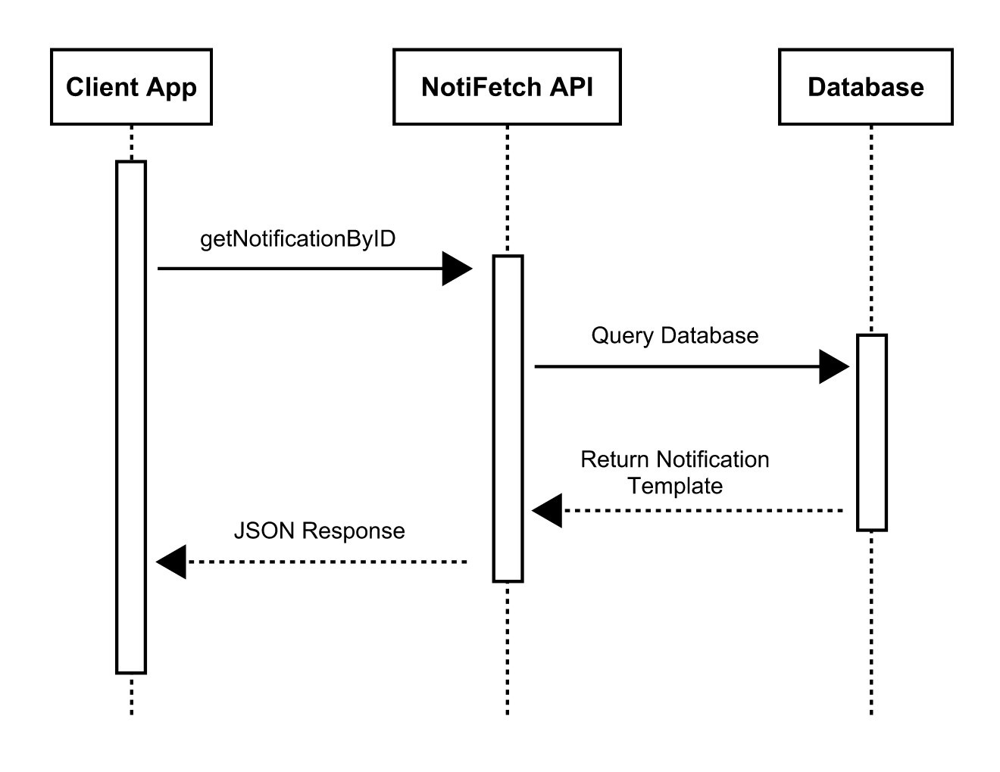

## NotiFetch API   
A lightweight notification microservice that provides **predefined notification templates** for different categories (e.g., `stock`, `system`, `user`, `alert`). Users can request notifications and fill in placeholders in their own applications.

---

### Communication Contract  
This API serves **read-only** predefined notifications. Users **cannot modify the database** but can retrieve notifications and fill in placeholders dynamically within their own application.  

Once defined, this **contract will not change**—your implementation should rely on these endpoints as they are.

---

### How to REQUEST Data from the Microservice  
To request notifications, send an **HTTP GET request** to the appropriate endpoint.

#### API URL: https://web-production-d1ba5.up.railway.app/

#### **Get All Notifications**

- **Endpoint:**  GET /notifications
  - **Example Response:** 
      ```json
      {
    "notifications": [
      {
        "id": 1,
        "type": "stock",
        "template": "Low stock warning for {item_name}. Only {quantity} left!",
        "placeholders": ["item_name", "quantity"],
      },
      {
        "id": 2,
        "type": "system",
        "template": "Scheduled maintenance at {time}.",
        "placeholders": ["time"],
      },
      {
        "id": 3,
        "type": "user",
        "template": "New user {username} has registered.",
        "placeholders": ["username"],
      },
      {
        "id": 4,
        "type": "alert",
        "template": "Unauthorized login attempt detected from {ip_address}.",
        "placeholders": ["ip_address"],
        }
        ]
    }


#### **Get All Notifications by Type**

- **Endpoint:**  GET /notifications/{notification_type}
- **Example Response:** {stock} 
    ```json
    {
  "notifications": [
    {
      "id": 1,
      "type": "stock",
      "template": "Low stock warning for {item_name}. Only {quantity} left!"
    },
    {
      "id": 2,
      "type": "stock",
      "template": "{item_name} has been restocked!"
      }
      ]
  }

#### **Get Notification by ID**

- **Endpoint:**  GET /notifications/{notification_id}
- **Example Response:** 
    ```json
    {
  "id": 2,
  "type": "stock",
  "template": "{item_name} has been restocked!"
    }
  
### Example: Filling in Placeholders (Python)  
Since this API provides notification templates with placeholders ({}), users must process the response in their own 
application. 

```python
import requests

# Fetch a notification
response = requests.get("https://web-production-d1ba5.up.railway.app/notifications/id/2")

if response.status_code == 200:
    data = response.json()
    template = data["template"]

    # Replace placeholders dynamically
    filled_message = template.format(item_name="Macbook")

    print(filled_message)  # Output: Macbook has been restocked!
else:
    print("Error:", response.json()["error"])
```

### UML Sequence Diagram 
